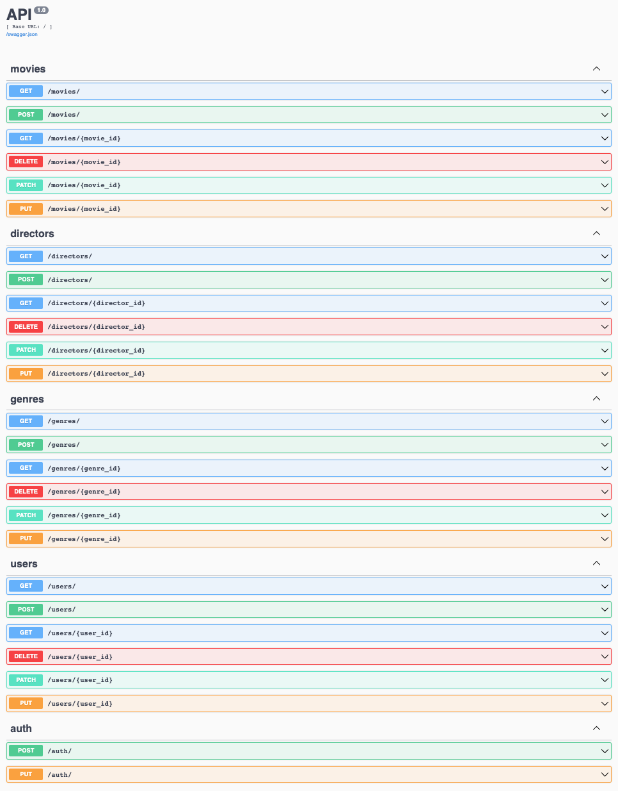

# Flask REST API

Данная программа - это реализация RESTful-сервера.\
API, которое выдает данные в формате json из базы данных про фильмы.




## Как установить

Для этого проекта требуются следующие пакеты Python:

- Flask >= 2.2.3
- Flask-SQLAlchemy >= 3.0.3
- Flask-RESTx >= 1.1.0
- marshmallow >= 3.19.0

Эти зависимости можно установить с помощью следующей команды:

```
pip install -r requirements.txt
```


## Запуск

Для запуска программы наберите одну из команд:

```
python main.py
```

После этого локальный сервер будет доступен по адресу:\
`http://localhost:5000`


## Подготовка базы данных

Программа работает с DBMS (СУБД) SQLite.\
Чтобы создать базу данных, необходимо перед первым запуском набрать команду:

```
python create_database.py
```


## Цель проекта

Код написан в образовательных целях. Начало проекта взято у [skypro](https://github.com/skypro-008/flask-hard-blank).
